# 你好，我是樊泽霖 👋

点击动态横幅，进入 Echoes / 回声在线体验

从室内设计师转型而来的 AI 产品经理，关注 AI 产品从 0 到 1、Agent 工作流与 AI Coding。

## 👤 关于我

过去的室内设计经历，让我形成了对视觉、空间与用户体验的敏感度，也积累了在复杂项目中协调客户、设计、施工与供应链等多方角色的经验。

现在，我把这些能力带进 AI 产品工作：既关注产品是否真正解决问题，也在意交互是否自然、信息是否清晰，以及团队能否把想法稳定地落地。

- 🎨 **审美与体验判断**：关注视觉表达、信息层级和完整的用户体验
- 🧩 **复杂需求拆解**：把模糊想法整理为清晰的产品路径与可执行方案
- 🤝 **多方协同推进**：理解不同角色的目标与约束，推动项目从概念走向交付
- ⚡ **AI 原型落地**：使用 AI Coding 快速验证产品假设，并持续迭代
- ✍️ **内容写作与方法沉淀**：将产品实践、行业观察与复杂问题整理为清晰、可传播的内容

## 🚀 产品案例

### 🌪️ Hurricane / 飓风

面向室内设计师的 AI 提效工作流平台，把参考图理解、专业提示词与可控生成串成一条清晰的设计路径。

- 读取参考图中的空间结构、视角与透视关系，优先保留关键空间约束
- 通过 Prompt Agent 补全材质、光影、氛围、摄影语言与画质要求
- 支持按探索成本选择生成数量，让方案验证更高效、更可控
- 将室内设计经验转化为产品能力：不替代设计判断，而是缩短表达与验证的路径

🖥️ [查看产品演示](http://47.102.213.94/) （HTTP 测试环境，请勿提交敏感信息）

### 🌌 [Echoes / 回声](https://github.com/fanzelin644-create/echoes-open-source)

个人独立开发的沉浸式 AI 八字命理解读与连续对话产品。

- 以确定性排盘规则为基础，结合大模型生成、规则校验与模板降级
- 支持分层解读、命运卡、深度报告、连续追问、合盘与大运流年
- 使用 Next.js、TypeScript、Prisma、Three.js 与 DeepSeek 等技术构建
- 完成从产品定位、功能架构和 AI 工作流，到开发、部署与体验迭代的完整闭环
- 将视觉体验、内容结构与 AI 能力整合为一套连贯的产品体验

🔗 [查看开源代码](https://github.com/fanzelin644-create/echoes-open-source) · 🚀 [在线体验](https://echoes-three-pi.vercel.app/) （部分网络环境可能需要代理）

## ✍️ 写作

我也通过公众号记录产品实践、行业观察与个人思考，在写作中梳理问题并沉淀方法。

- 📖 [查看我的公众号文章](https://mp.weixin.qq.com/s/g1YrxDpv8vBwHDkB6Q3PqA)

## 🧰 开源工具

### 📝 [claude-skills](https://github.com/fanzelin644-create/claude-skills)

面向产品经理的 PRD 需求文档生成 Skill，帮助将产品想法整理为结构化、可执行的需求文档。

## 🔭 目前关注

- AI 产品设计与落地
- Agent 架构、工作流编排与质量控制
- AI Coding 与快速原型验证
- 用户体验、视觉表达与复杂项目协同
